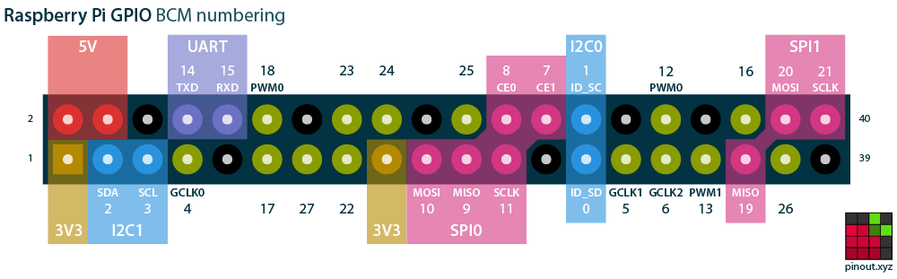

# RadSense Radiation Sensor on Raspberry Pi 4

## 1. Project Description
This project demonstrates how to interface the RadSense radiation sensor with a Raspberry Pi 4 using I2C communication. The Python script `Rad_sense_plotter.py` reads radiation data from the sensor and plots it in real-time. The setup runs on a Raspberry Pi 4 with proper wiring to specific GPIO pins.

## 2. Wiring the Sensor to Raspberry Pi 4
To correctly wire the RadSense sensor to the Raspberry Pi 4, refer to the following table:

| RadSense Pin     | Raspberry Pi 4 Pin |
|------------------|--------------------|
| 3v3              | Pin 1 (3.3V)       |
| GND              | Pin 6 (GND)        |
| SCL              | Pin 5 (GPIO 3, SCL)|
| SDA              | Pin 3 (GPIO 2, SDA)|

For visual guidance, see the pinout diagram below:



## 3. Enabling I2C on Raspberry Pi 4
To enable the I2C communication interface, follow these steps:

1. Open the terminal and run:
   ```bash
   sudo raspi-config
   ```
## 3. Enabling I2C on Raspberry Pi 4
To enable the I2C communication interface, follow these steps:

1. Open the terminal and run:
   ```bash
   sudo raspi-config
   ```
2. Navigate to Interfacing Options and select I2C.
3. Enable the I2C interface.
4. Reboot the Raspberry Pi:
   ```bash
   sudo reboot
   ```
## 4. Running the RadSense Plotter Script
Once the wiring and configuration are complete, run the following command to start reading and plotting radiation data:
   ```bash
   python3 Rad_sense_plotter.py
   ```


Here is a GIF of the script in action
